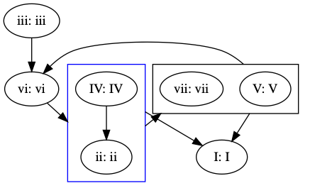
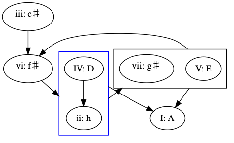
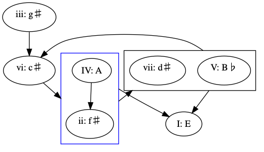
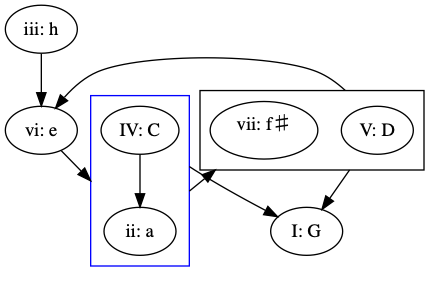
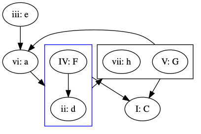
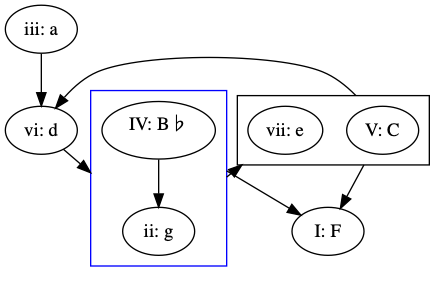
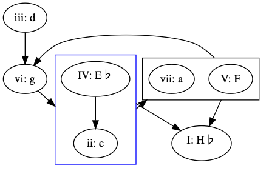

# Generate some  chord sequences to start the creative process

Inspired by a graph I found in the book "Making music, 74 strategies
for electronic music producers", this is a small script that will generate
graphs with plausible chord sequence based on the abstract schema:

* The .dot files represents the graphs
* The .pdf files are printable representations of the graphs.
* The .sh file generates both the .dot and .pdf files.
* The .key file is a keynote file that contains some of the graphs
   in a compact form on a single page.

This is free software, Apache 2 licensed.

# The results generated are:

## A root

## E root

## G root

## C root

## F root

## bH (bB) root

